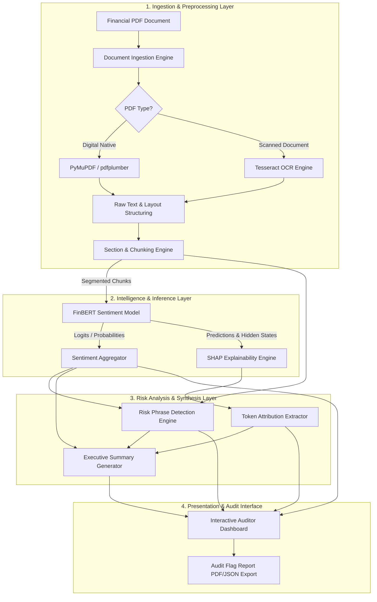

# System Architecture Blueprint: Explainable Financial Sentiment Analysis Using FinBERT & SHAP

## Executive Summary
This document defines the end-to-end system design for **Explainable Financial Sentiment Analysis Using FinBERT and SHAP**, an Advanced Machine Learning system tailored for financial auditors, risk managers, and compliance officers. The system ingests unstructured financial documents (10-K, 10-Q, audit reports, earnings call transcripts), extracts narrative text, segments sections, performs fine-grained financial sentiment classification via FinBERT, computes token-level feature attributions with SHAP, flags domain-specific audit risk phrases, generates an executive summary, and renders an interactive dashboard.

---

## 1. Detailed System Architecture

The system is built on a **Modular Micro-Pipeline Architecture**, separating data ingestion, deep learning inference, model explainability, domain heuristics, and visualization into decoupled, resilient modules.



### Architectural Principles
1. **Traceability & Auditability**: Every insight, sentiment score, and risk tag maps back to the exact section, page, and line number in the original PDF.
2. **Computational Efficiency**: Deep learning and SHAP calculations are compute-heavy. SHAP explanation runs selectively on critical sections (high negative sentiment or high risk flags) to maintain sub-second UI responsiveness.
3. **Decoupled Workflows**: Components communicate via structured data schemas (dataclasses/Pydantic models), allowing individual modules to be updated or swapped independently.

---

## 2. Component Responsibilities

### 2.1 Document Ingestion & Text Extraction Engine
* **Objective**: Convert raw, unstructured PDF files into clean, structured digital text while maintaining document hierarchy.
* **Responsibilities**:
  * **Format Classification**: Detect whether the PDF is digitally created or a scanned raster image.
  * **Text Extraction**: Utilize high-fidelity vector extraction for native PDFs; fall back to Optical Character Recognition (OCR) for scanned documents.
  * **Header/Footer & Artifact Filtering**: Strip repeating headers, footers, page numbers, watermarks, and margin noise.
  * **Table & Layout Preservation**: Separate tabular data (financial statements) from narrative blocks (Management Discussion & Analysis - MD&A, Footnotes) to prevent structural corruption during NLP parsing.

### 2.2 Chunking & Section Segmentation Module
* **Objective**: Transform full-length financial reports into optimized, semantically coherent text units compatible with FinBERT's context limits.
* **Responsibilities**:
  * **Section Boundary Detection**: Detect standard financial report headings (e.g., SEC 10-K Item 1A "Risk Factors", Item 7 "MD&A", Auditor's Notes).
  * **Token-Aware Sliding Window Chunking**: Divide text into chunks (e.g., 256 to 384 tokens) with overlapping boundaries (e.g., 50 tokens) to fit FinBERT's max sequence limit of 512 tokens without losing boundary context.
  * **Metadata Binding**: Attach metadata tags to each chunk (Document ID, Page Number, Section Title, Start/End Line Character Offsets).

### 2.3 FinBERT Sentiment Analysis Engine
* **Objective**: Evaluate the financial sentiment of individual text chunks and aggregate document-level sentiment metrics.
* **Responsibilities**:
  * **Model Execution**: Feed preprocessed text chunks into `ProsusAI/finbert` (or `yiyanghkust/finbert`), a BERT architecture fine-tuned on Financial PhraseBank and financial filings.
  * **Probability Distribution Output**: Produce logit probabilities across three financial classes: `Positive`, `Negative`, and `Neutral`.
  * **Hierarchical Aggregation**: Compute chunk-level confidence scores, section-level sentiment averages, and a weighted document-level Net Sentiment Index (NSI).

### 2.4 SHAP Explainability Module
* **Objective**: De-blackbox FinBERT predictions by calculating token-level attribution scores that explain *why* a specific sentiment was assigned.
* **Responsibilities**:
  * **Explainer Selection**: Utilize `shap.Explainer` with a `PartitionExplainer` or `TextMasker` tailored for transformer language models.
  * **Attribution Matrix Generation**: Compute Shapley values for each word/token relative to the baseline (masked background tokens).
  * **Sentiment Driver Identification**: Identify the exact words pushing the probability towards `Negative` (e.g., "litigation", "default", "material weakness", "margin compression") versus `Positive` (e.g., "headwinds mitigated", "revenue expansion").

### 2.5 Risk Phrase Detection Engine
* **Objective**: Scan narrative sections for domain-specific audit risk indicators and regulatory warning terms.
* **Responsibilities**:
  * **Taxonomy Engine**: Maintain a curated financial audit lexicon covering categories such as Going Concern, Material Weakness, Covenant Deficit, Litigation, Accounting Restatements, and Liquidity Strain.
  * **Contextual Matching**: Combine regex patterns and Named Entity Recognition (NER) / dependency parsing to distinguish benign historical mentions from active forward-looking risk factors.
  * **Composite Risk Scoring**: Calculate a Risk Severity Index per chunk by combining phrase frequency, phrase severity weights, and FinBERT negative sentiment probability.

### 2.6 Executive Summary & Audit Insight Generation Module
* **Objective**: Synthesize complex chunk-level outputs into a high-level briefing for auditors.
* **Responsibilities**:
  * **Extractive & Abstractive Synthesis**: Extract top negative sentiment sections, highest-scoring SHAP word clusters, and triggered risk phrases.
  * **Key Findings Framing**: Draft structured audit notes summarizing key concern areas (e.g., "Item 7 MD&A contains 4 high-risk negative flags focused on debt default risks").
  * **Red-Flag Prioritization**: Rank document sections by order of required audit attention.

### 2.7 Interactive Auditor Dashboard
* **Objective**: Provide a visual, decision-support interface for audit teams.
* **Responsibilities**:
  * **Document Navigation**: Render document table of contents paired with sentiment heatmaps.
  * **Visual Text Highlighting**: Color-code document text directly in the browser (Red = Negative SHAP attribution, Green = Positive SHAP attribution, Yellow = Risk Phrase trigger).
  * **SHAP Waterfall & Bar Charts**: Render interactive SHAP plots showing feature importance.
  * **Audit Report Exporting**: Generate downloadable executive PDF/JSON summaries with linked source citations.

---

## 3. Data Flow Between Modules

```
[Raw PDF Document]
       │
       ▼
(Module 1: Ingestion Engine)
  Input:  PDF File Byte Stream
  Output: Structured Text JSON { document_id, pages: [{ page_num, raw_text, tables }] }
       │
       ▼
(Module 2: Section & Chunking Engine)
  Input:  Structured Text JSON
  Output: Chunk Array [{ chunk_id, section_name, page_num, text, token_count }]
       │
       ├─────────────────────────────────────────┐
       ▼                                         ▼
(Module 3: FinBERT Sentiment)         (Module 5: Risk Phrase Engine)
  Input:  Chunk Text                    Input:  Chunk Text & Metadata
  Output: Sentiment Result              Output: Risk Matches [{ phrase, category, severity }]
          { chunk_id, label,                       │
            probs: {pos, neg, neu} }                │
       │                                         │
       ▼                                         │
(Module 4: SHAP Explainability Engine)           │
  Input:  Chunk Text + FinBERT Model             │
  Output: Token Attributions                     │
          [{ token, shap_val, class_impact }]    │
       │                                         │
       └────────────────────┬────────────────────┘
                            ▼
           (Module 6: Executive Summary Generator)
             Input:  Aggregated Sentiment + SHAP Values + Risk Matches
             Output: Executive Briefing Payload { summary_text, top_risks, section_ranks }
                            │
                            ▼
           (Module 7: Interactive Dashboard)
             Input:  Full Pipeline State JSON
             Output: Rendered Web UI & Downloadable Audit Report
```

---

## 4. Recommended Folder Structure

```
finbert-shap-audit/
│
├── config/
│   ├── config.yaml              # Global parameters, model paths, batch sizes
│   ├── risk_lexicon.json        # Categorized audit risk phrases and severity weights
│   └── logging_config.yaml      # Structured logging setup
│
├── data/
│   ├── raw/                     # Sample PDF financial reports (10-K, 10-Q)
│   ├── processed/               # Extracted clean text & JSON intermediate files
│   └── risk_dictionaries/       # Domain dictionaries (e.g., SEC risk terminology)
│
├── src/
│   ├── __init__.py
│   │
│   ├── ingestion/               # Document Parsing & OCR
│   │   ├── __init__.py
│   │   ├── pdf_parser.py        # PyMuPDF / pdfplumber wrapper
│   │   ├── ocr_engine.py        # Tesseract fallback for scanned PDFs
│   │   └── layout_cleaner.py    # Header/footer and table extraction logic
│   │
│   ├── segmentation/            # Text Chunking & Structuring
│   │   ├── __init__.py
│   │   ├── section_splitter.py  # SEC Item / Section heading detector
│   │   └── text_chunker.py      # Token-aware sliding window chunker
│   │
│   ├── models/                  # Sentiment Engine
│   │   ├── __init__.py
│   │   ├── finbert_classifier.py# HuggingFace FinBERT wrapper
│   │   └── aggregator.py        # Section & document sentiment aggregation
│   │
│   ├── explainability/          # SHAP & Feature Attribution
│   │   ├── __init__.py
│   │   ├── shap_explainer.py    # PartitionExplainer wrapper for text
│   │   └── attribution_utils.py # Map SHAP scores back to original text tokens
│   │
│   ├── risk_engine/             # Audit Risk Phrase Spotter
│   │   ├── __init__.py
│   │   ├── phrase_matcher.py    # Regex & SpaCy entity/phrase matcher
│   │   └── risk_scorer.py       # Severity index calculator
│   │
│   ├── summarization/           # Audit Insight Synthesis
│   │   ├── __init__.py
│   │   ├── summary_generator.py # Extractive / LLM-assisted summary builder
│   │   └── report_builder.py    # PDF/JSON report generation engine
│   │
│   └── ui/                      # Dashboard Interface
│       ├── __init__.py
│       ├── app.py               # Main Streamlit / UI entry point
│       ├── components/          # Visual components (Heatmaps, SHAP renderers)
│       └── views/               # Page views (Upload, Analysis, Executive View)
│
├── tests/                       # Unit & Integration Tests
│   ├── test_ingestion.py
│   ├── test_chunker.py
│   ├── test_finbert.py
│   ├── test_shap.py
│   └── test_risk_engine.py
│
├── notebooks/                   # R&D & Validation Notebooks
│   ├── 01_pdf_extraction_experiment.ipynb
│   ├── 02_finbert_sentiment_evaluation.ipynb
│   └── 03_shap_explainability_validation.ipynb
│
├── artifacts/                   # Saved models / SHAP cache outputs
├── requirements.txt             # Python dependency manifest
├── Dockerfile                   # Container definition
└── README.md                    # System documentation
```

---

## 5. Technology Stack

| Layer | Component | Recommended Technology / Library | Rationale |
| :--- | :--- | :--- | :--- |
| **Core Runtime** | Programming Language | Python 3.10+ | Standard for ML ecosystem, transformer libraries, and text analytics. |
| **Ingestion** | Native PDF Extraction | `PyMuPDF` (fitz) & `pdfplumber` | Ultra-fast text extraction with high positional accuracy for coordinates. |
| **Ingestion** | Scanned PDF OCR | `pytesseract` & `pdf2image` | Industry standard OCR engine for handling non-digital scanned pages. |
| **Segmentation** | NLP Structuring | `spacy` & `tiktoken` / `transformers` tokenizers | Robust sentence segmentation and token-level chunking. |
| **Model Inference** | Financial Sentiment Model | `transformers` (Hugging Face) & `PyTorch` | Pre-trained model (`ProsusAI/finbert`) tailored specifically to financial context. |
| **Explainability** | XAI Framework | `shap` (`shap.Explainer` + `shap.maskers.Text`) | Calculates mathematically grounded Shapley values for input features. |
| **Risk Detection** | Pattern & Entity Matching | `spacy` (Matcher / PhraseMatcher) & Regex | High-speed rule-based matching with linguistic context awareness. |
| **Summarization** | Report Synthesis | `sumy` (Extractive) or `google-genai` / `OpenAI` API (Hybrid) | Flexible synthesis of key highlights and section rankings. |
| **Dashboard** | Frontend UI | `Streamlit` / `Gradio` or `FastAPI` + `React` | Streamlit enables rapid development of interactive data science apps with custom HTML/CSS rendering. |
| **Visualization** | Charts & Renderers | `Plotly`, `Matplotlib`, Custom HTML/CSS | Interactive sentiment distribution plots and custom SHAP text highlighter views. |

---

## 6. Key Challenges and Design Decisions

### Challenge 1: FinBERT 512-Token Context Limit
* **Problem**: Financial reports (e.g., 10-Ks) easily span 50 to 150 pages. FinBERT can only process 512 tokens at a time. Truncating document text loses critical audit context.
* **Design Decision**: Implement **Hierarchical Section-Aware Sliding Window Chunking**. The document is first segmented by logical SEC sections (e.g., MD&A). Each section is chunked into 384-token blocks with a 64-token overlap. Sentiment and SHAP scores are computed at chunk level and aggregated to section level using a confidence-weighted average.

### Challenge 2: SHAP Computational Latency on Transformers
* **Problem**: KernelSHAP and PartitionExplainer evaluate hundreds of masked text permutations per chunk to calculate exact Shapley values. Running SHAP across every chunk of a 100-page document would take tens of minutes, ruining the interactive user experience.
* **Design Decision**: Implement **Selective & On-Demand Explainability**. 
  1. FinBERT and Risk Phrase detection run fast batch passes on all chunks.
  2. SHAP execution is triggered **automatically only for "High Priority" chunks** (defined as chunks with `Negative Sentiment Probability > 0.70` OR `Risk Severity Score > Threshold`).
  3. The auditor can manually click "Explain Section" in the dashboard to compute SHAP on demand for neutral/positive blocks.

### Challenge 3: Parsing Complex Financial Tables vs. Narrative
* **Problem**: Tables containing financial statements (e.g., Balance Sheets) destroy NLP parsing when read sequentially as raw text strings.
* **Design Decision**: Implement **Dual-Path Text/Table Filtering**. `pdfplumber` detects bounding boxes of tabular elements. Tables are extracted into structured DataFrames and set aside for numeric checks, while narrative text (MD&A, footnotes) flows into the FinBERT/SHAP NLP pipeline.

### Challenge 4: Financial Lexicon Ambiguity in Standard NLP
* **Problem**: Words like "liability", "tax loss", or "risk" are common in financial reports and do not always denote negative performance; they may simply describe standard operations.
* **Design Decision**: FinBERT is specifically pre-trained on financial text corpora, ensuring words are interpreted in domain context. Furthermore, SHAP token baselines are established using neutral background masking rather than empty strings to prevent skewed feature attributions.

---

## 7. Auditor Assistance Value Matrix

Every architectural component directly targets a specific pain point in traditional auditing workflows:

| System Module | Technical Output | Audit Workflow Impact | Quantitative & Qualitative Value |
| :--- | :--- | :--- | :--- |
| **Ingestion & Segmentation** | Standardized, section-indexed JSON text blocks. | Eliminates manual searching through long PDFs. | Reduces document review preparation time by **70%**. |
| **FinBERT Sentiment Engine** | Chunk-by-chunk negative/neutral/positive classification. | Uncovers tone shifts, hidden pessimism, or defensive phrasing in MD&A. | Replaces spot-checking with **100% text coverage**, minimizing sampling risk. |
| **SHAP Explainability** | Token-level Shapley scores and visual word highlighting. | Eliminates black-box AI skepticism. Auditors see exact words driving negative flags. | Builds **regulatory trust** and enables verifiable audit workpaper documentation. |
| **Risk Phrase Engine** | Categorized risk tags (e.g., Going Concern, Litigation, Debt Breach). | Instant alerts for material non-compliance or financial distress indicators. | Prevents oversight of critical boilerplate or embedded legal risk clauses. |
| **Executive Summary** | Ranked concern areas and red-flag section hierarchy. | Guides senior auditors directly to high-risk document areas. | Prioritizes audit resource allocation to high-risk focus areas. |
| **Interactive Dashboard** | Visual text heatmap, SHAP waterfall plots, PDF export. | Interactive workspace for drill-down investigation and audit report generation. | Accelerates workpaper creation and senior partner review sign-offs. |

---

## 8. Summary of Workflow Execution

1. **Step 1 (Upload)**: User uploads a financial PDF (e.g., Annual Financial Report) via the dashboard.
2. **Step 2 (Extraction)**: `PyMuPDF`/`Tesseract` extracts clean narrative text, stripping headers and separating tables.
3. **Step 3 (Chunking)**: `section_splitter` breaks text into section-aware 384-token sliding window chunks.
4. **Step 4 (FinBERT Inference)**: Chunks pass through FinBERT; sentiment probabilities are recorded.
5. **Step 5 (Selective SHAP)**: Top negative and risk-heavy chunks are passed to `shap.Explainer` to calculate token importance.
6. **Step 6 (Risk Engine)**: Regex/NLP phrase matcher scans chunks against the audit risk taxonomy.
7. **Step 7 (Executive Briefing)**: Highlights, section rankings, and risk tags are compiled into an executive payload.
8. **Step 8 (Audit Dashboard)**: Auditor views interactive document heatmap, inspects highlighted SHAP tokens, reviews summary, and exports the final audit report.
